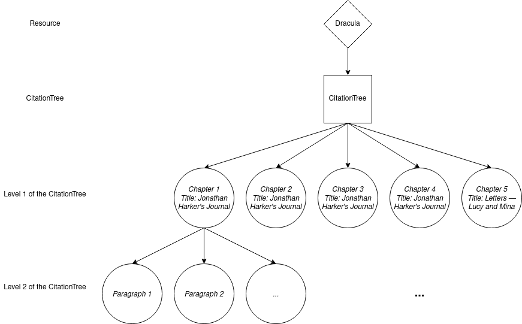
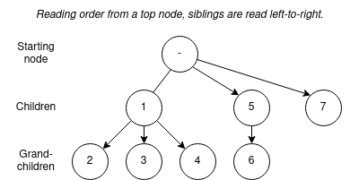

Navigation Endpoint
====================

## Introduction

The Navigation endpoint provides information about a Resource's internal structures (e.g., book, chapter, line, etc.) and how they are referenced. While the Collection endpoint allows for finding Resources within a collection, the Navigation endpoint describes the relationship between structural divisions in the text. References found in the Navigation endpoint can also be used to retrieve corresponding portions of the Resource's text from the Document endpoint.

The Navigation endpoint provides JSON objects that describe sections in a Resource's citation tree. A citation tree is represented by a structured hierarchy of `CitableUnit` objects. In general, applications using the Navigation endpoint are moving down and forward through the document.

Using the Navigation endpoint, clients will be able to:

- construct a table of contents
- display a novel by chapter or a book of poetry by poem
- find out how to traverse a Resource from one structural section to another
- construct links to specific sections of the Resource
- find metadata about a specific section of a Resource (e.g., the writer of one letter in a correspondence)

## What Is a Citation Tree?

When discussing a text, it is common to use labels to identify sections of the text. When referring to pages, for example, we might identify them with numbers. In other situations we might divide the text into logical structures that are hierarchically organized. For example, we might identify "Paragraph 4" within "Section D" which falls within "Chapter 1." In both cases, these structuring labels form citation trees, though with different depths. (A depth of 1 for "pages" and a depth of 3 for "chapter"/"section"/"paragraph.")

The depth of a citation tree can be uneven. In a Ph.D. thesis, for example, the introduction may not be subdivided, while a chapter will often have subdivisions.

It can be that the same text can be discussed using more than one different structuring hierarchy. In the context of a text that has both been printed and made available online, it is not rare to find people referring to the printed version by "page" and the web version by "paragraph." These competing citation trees can often lead to confusion.

Taking the novel *Dracula*, the text can be modeled as follows:



## Scheme for Navigation Endpoint Responses

### `Navigation` Object

The top-level response object is a `Navigation` object answering a query about the citation tree of a Resource, containing details about nodes within that tree.

| Name |  Type  |  Required | Description                              |
| ---- | ------ | --------- | -----------------------------|
| `@id` | URL | Y | The absolute URL of the current request including any query parameters. |
| `@type` | string | Y | The object's RDF class which must be "Navigation". |
| `passage` | URL template | Y | The URI template to the Document endpoint at which the text of nodes in the citation tree can be retrieved. |
| `navigation` | URL template | Y | The URI template to the Navigation endpoint at which the citation tree structure can be queried. |
| `resource`| Resource | Y | The `Resource` whose citation tree is being queried. |
| `ref` | CitableUnit | N | The `CitableUnit` in the citation tree which is being queried. |
| `start` | CitableUnit | N | The `CitableUnit` at the beginning of the range in the citation tree which is being queried. |
| `end` | CitableUnit | N |  The `CitableUnit` at the end of the range in the citation tree which is being queried. |
| `member` | array | N | An array of `CitableUnit` in the subtree specified by the query parameters. |
| `dtsVersion` | string | Y | The version of the DTS specification the response. Default is "1". |

Because the `Navigation` object is a top-level object in the API, each object must also have a `@context` property pointing to a DTS JSON-LD context object such as "https://distributed-text-services.github.io/specifications/context/1.0.0draft-2.json".

### Resource

| Name |  Type  |  Required | Description                              |
| ---- | ------ | --------- | -----------------------------|
| `@id` | URI | Y | The URI of the `Resource`. |
| `@type` | string | Y | The object's RDF class which must be "Resource". |
| `collection` | URL template | Y | The URI template to the Collection endpoint at which the `Resource` can be found. |
| `citationTrees` | array | Y | An array of `CitationTree` objects |
| `mediaTypes` | array | N | An array of string identifiers for the response body media types (Content-Type values) supported for the `Resource` in Document endpoint queries. |

If a `Resource` has a single `CitationTree`, that `CitationTree` object cannot have an `identifier`.

If a `Resource` has multiple `CitationTree`s, then the first listed in `citationTrees` is the default `CitationTree` and cannot have an `identifier`.

If a `Resource` is a document without a citation tree, the `citationTrees` property is an empty array.

Values in the `mediaTypes` array must correspond to content types that the implementation supports as values for the `mediaType` query parameter when requesting segments of the `Resource`'s content via the Document endpoint.

### CitationTree

| Name |  Type  |  Required | Description                              |
| ---- | ------ | --------- | -----------------------------|
| `identifier` | string | N | The string identifier of the `CitationTree`. |
| `@type` | string | Y | The object's RDF class which must be "CitationTree". |
| `citeStructure` | array | N | An array of `CiteStructure` objects. |
| `maxCiteDepth` | int | Y | An integer defining the maximum depth of the Resource's citation tree. |
| `description` | string | N | A human readable description of the citation tree. |

### CiteStructure

| Name |  Type  |  Required | Description                              |
| ---- | ------ | --------- | -----------------------------|
| `citeStructure` | array | N | An array of `CiteStructure` objects. |
| `citeType` | string | N | A type of textual unit that appears at a given level in the citation tree. (E.g., "chapter", "verse") |

### CitableUnit

| Name |  Type  |  Required | Description                              |
| ---- | ------ | --------- | -----------------------------|
| `identifier` | string | Y | The string identifier of the `CitableUnit`. |
| `@type` | string | Y | The object's RDF class which must be "CitableUnit". |
| `level` | int | Y | A number identifying the depth at which the `CitableUnit` is found within the citation tree of the `Resource`. |
| `parent` | nullable string | Y | The string identifier of the hierarchical parent of the `CitableUnit` in the `Resource`. |
| `citeType` | string | N | The type of textual unit corresponding to the `CitableUnit` in the Resource. (E.g., "chapter", "verse") |
| `dublinCore` | object | N | Dublin Core Terms metadata describing the `CitableUnit`. |
| `extensions` | object | N | Metadata for the `CitableUnit` from vocabularies other than Dublin Core Terms. |

#### Unique `identifier`s

The `identifier` of a `CitableUnit` must be unique within a `CitationTree` for a `Resource`.

#### Values for the `parent` Property

If the `CitableUnit` parent is the root level of the `Resource`, the value returned for `parent` should be `null`.

```json
{
  "identifier": "Luke",
  "level": 1,
  "@type": "CitableUnit",
  "parent": null
}
```

## URI for Navigation Endpoint Requests

### Query Parameters

| Name | Type | Description                              | Methods | Constraints |
|------|------ | ------------------------------------|---------| ----------- |
| resource   | URI | The unique identifier for the Resource being navigated |  GET    ||
| ref | string | The string identifier of a single node in the citation tree for the Resource, used as the point of reference for the query. | GET    | NOT used with `start` and `end` |
| start | string | The string identifier of a node in the citation tree for the resource, used as the starting point for a range that serves as the reference point for the query. This parameter is inclusive, so the starting point is considered part of the specified range. | GET | NOT used if a `ref` is specified, requires `end` as well |
| end |  string | The string identifier of a node in the citation tree for the resource, used as the ending point for a range of passages that serves as the reference point for the query. This parameter is inclusive, so the supplied ending point is considered part of the specified range. | GET | NOT used if a `ref` is specified, requires `start` as well |
| down | int | The maximum depth of the citation subtree to be returned, relative to the specified `ref`, the deeper of the `start`/`end` `CitableUnit`, or if these are not provided relative to the root. A value of `-1` indicates the bottom of the `Resource` citation tree. | GET    |If `down` is not provided only retrieve information about the queried `CitableUnit` |
| tree | string | The string identifier for a `CitationTree` of the `Resource`. | GET | NOT used to query the default `CitationTree` |
| page | int | The number of identifying a page in paginated query results. | GET | |

#### Errors

Some combinations of query parameters and their values must return a 4XX HTTP Error. A 400 Bad Request Error should be returned when:
  - no `resource` value is provided
  - both `ref` and either `start` or `end` is specified
  - `start` is provided without also specifying `end`, or vice versa
A 404 Not Found Error should be returned when
  - a query specifies a `ref`, `start`, or `end` value that does not exist in the queried `CitationTree`
  - a query specifies a `tree` value that does not correspond to an existing `CitationTree` for the `Resource`

#### Usage of `tree`

All requests on a `Resource` without any `CitationTree`s at the `Navigation` endpoint will return an empty `member` array and must not return an HTTP error.

If no `tree` parameter is specified, the default `CitationTree` of the `Resource` must be used to traverse the `Resource`.

#### Usage of `down`, `ref`, `start` and `end`

| `down` | `ref` | `start`/`end` | Result |
| ------ | ----- | ------------- | ------ |
| absent | absent | absent | 400 Bad Request Error |
| absent | present | absent | Information about the `CitableUnit` identified by `ref`. No member property in the `Navigation` object. |
| absent | absent | present | Information about the `CitableUnit`s identified by `start` and by `end`. No member property in the `Navigation` object. |
| 0 | present | absent | Information about the `CitableUnit` identified by `ref` along with a `member` property that is an array of `CitableUnit`s that are siblings (sharing the same parent) including the current `CitableUnit` identified by `ref`. |
| 0 | absent | present | 400 Bad Request Error |
| > 0 | absent | absent | A `member` array of `CitableUnit`s including the citation tree from the root to the depth requested in `down`. |
| > 0 | present | absent | A `member` array of `CitableUnit`s including the citation tree from the `CitableUnit` identified by `ref` to the depth requested in `down`. |
| > 0 | absent | present | A `member` array of `CitableUnit`s including the citation tree between the `start` and `end` `CitableUnit`s inclusive, down to a depth relative to the deeper of the `CitableUnit`s identified by `start` and `end`. |
| -1 | absent | absent | A `member` array of `CitableUnit`s including the citation tree from the root to the deepest level of the `CitationTree`. |
| -1 | present | absent | A `member` array of `CitableUnit`s including the citation tree from the `CitableUnit` identified by `ref` to the deepest level of the `CitationTree`. |
| -1 | absent | present | A `member` array of `CitableUnit`s including the citation tree between the `start` and `end` `CitableUnit`s inclusive, down to the deepest level of the `CitationTree`. |

#### Handling Requests with No Matching `CitableUnit`s

A `Navigation` endpoint request may specify a level in a `Resource`'s `CitationTree` that does not exist. One may, e.g., provide a `down` value of `3` when only `1` lower level exists in the `Resource`'s `CitationTree`. In this case the `member` array will simply include any `CitableUnit`s that do satisfy the parameters.

If there are no `CitableUnit`s at all that satisfy the parameters of a `Navigation` endpoint request:

- the request must not raise an error
- the `Navigation` object `member` property must be an empty array.

For example, if the `ref` is at the bottom level of the queried `CitationTree`, and a `down` of 2 is provided in the request, the response will provide an empty array as its `member` value.

#### Order of `CitableUnit`s in `member`

The `CitableUnits` listed in the returned `member` property must be in document order as defined in the XPath 3.1 specification: https://www.w3.org/TR/xpath-31/#dt-document-order.

This is a "pre-order, depth first" traversal moving through nodes of the citation tree as follows:




## Response Headers

Responses from the `Navigation` endpoint should include an HTTP response header identifying the `Content-Type` of the response as `application/ld+json`.

| Key          | Value                             |
| ------------ | --------------------------------- |
| Content-Type | Content-Type: application/ld+json |

## Examples

### Writing Conventions for the Examples

In the following examples, JavaScript comments such as /_ ... _/ are used to indicate that more information may be found at this point in the Response body.

Note, too, that the `CitableUnit` objects in most of the examples are kept minimal for the sake of clear illustration. In many actual implementations each of these would include `dublinCore` and `extensions` properties containing additional metadata. The choice of what additional content to include in these properties, though, is up to the implementer.

### Example 1: Requesting top-level `CitableUnit`s of a `Resource`

The client wants to retrieve an array of `CitableUnit`s that are part of the `Resource` with the identifier "https://en.wikisource.org/wiki/Dracula". In other words, the client wants an array of the top-level nodes in the resource's citation tree. Since no `ref`, `start`, or `end` query parameters are specified, the response object lacks any `ref`, `start` or `end` properties. It simply returns the requested `CitableUnits` as an array in the `member` property of the `Navigation` object.

#### Example of url :

- `https://example.org/api/dts/navigation/?resource=https://en.wikisource.org/wiki/Dracula&down=1`

#### Response Headers

| Key          | Value                             |
| ------------ | --------------------------------- |
| Content-Type | Content-Type: application/ld+json |

#### Response Body

```json
{
  "@context": "https://distributed-text-services.github.io/specifications/context/1.0.0draft-2.json",
  "dtsVersion": "1",
  "@id": "https://example.org/api/dts/navigation/?resource=https://en.wikisource.org/wiki/Dracula&down=1",
  "passage": "https://example.org/dts/api/document/{?resource,ref,start,end,format}",
  "collection": "https://example.org/dts/api/collection/{?resource,page,nav}",
  "navigation": "https://example.org/dts/api/navigation/{?resource,ref,down,start,end,tree,page}",
  "resource": {
    "@id": "https://en.wikisource.org/wiki/Dracula",
    "@type": "Resource",
    "citationTrees": [
      {
        "@type": "CitationTree",
        "maxCiteDepth": 3,
        "citeStructure": [
          {
            "@type": "CiteStructure",
            "citeType": "Chapter",
            "citeStructure": [
              {
                "@type": "CiteStructure",
                "citeType": "Journal Entry",
                "citeStructure": [
                  {
                    "@type": "CiteStructure",
                    "citeType": "Paragraph"
                  }
                ]
              }
            ]
          }
        ]
      }
    ]
  },
  "member": [
    {
      "identifier": "C1",
      "@type": "CitableUnit",
      "level": 1,
      "parent": null,
      "citeType": "Chapter",
      "dublinCore": {
        "title": {
          "lang": "en",
          "value": "Chapter 1: Jonathan Harker's Journal"
        }
      }
    },
    {
      "identifier": "C2",
      "@type": "CitableUnit",
      "level": 1,
      "parent": null,
      "citeType": "Chapter",
      "dublinCore": {
        "title": {
          "lang": "en",
          "value": "Chapter 2: Jonathan Harker's Journal - Continued"
        }
      }
    },
    {
      "identifier": "C3",
      "@type": "CitableUnit",
      "level": 1,
      "parent": null,
      "citeType": "Chapter",
      "dublinCore": {
        "title": {
          "lang": "en",
          "value": "Chapter 3: Jonathan Harker's Journal - Continued"
        }
      }
    }
    /* ... */
  ]
}
```

### Example 2: Requesting the `Resource`'s complete citation tree down to a specified level

The client wants to retrieve an array of all `CitableUnit`s in the `Resource` identified as "https://en.wikisource.org/wiki/Dracula" down to the second level of the `Resource`'s citation tree (in this case chapters and their paragraphs). We are not requesting the descendants of any single upper-level node (i.e., chapter), so response will provide the entire top two levels of the citation tree. Since no `ref`, `start`, or `end` query parameters are specified, the returned `Navigation` object has no `ref`, `start`, or `end` properties. The requested array of `CitableUnits` are simply returned in the `member` property.

#### Example of url :

- `https://example.org/api/dts/navigation/?resource=https://en.wikisource.org/wiki/Dracula&down=2`

#### Response Headers

| Key          | Value                             |
| ------------ | --------------------------------- |
| Key          | Value                             |
| ------------ | --------------------------------- |
| Content-Type | Content-Type: application/ld+json |

#### Response Body

```json
{
    "@context": "https://distributed-text-services.github.io/specifications/context/1.0.0draft-2.json",
    "dtsVersion": "1",
    "@id":"https://example.org/api/dts/navigation/?resource=https://en.wikisource.org/wiki/Dracula&down=2",
    "passage": "https://example.org/dts/api/document/{?resource,ref,start,end,format}",
    "collection": "https://example.org/dts/api/collection/{?resource,page,nav}",
    "navigation": "https://example.org/dts/api/navigation/{?resource,ref,down,start,end,tree,page}",
    "resource": {
      "@id": "https://en.wikisource.org/wiki/Dracula",
      "@type": "Resource",
      "citationTrees": [
        {
          "@type": "CitationTree",
          "maxCiteDepth" : 3,
          "citeStructure": [
            {
              "@type": "CiteStructure",
              "citeType": "Chapter",
              "citeStructure": [
                {
                  "@type": "CiteStructure",
                  "citeType": "Journal Entry",
                  "citeStructure": [
                    {
                      "@type": "CiteStructure",
                      "citeType": "Paragraph"
                    }
                  ]
                }
              ]
            }
          ]
        }

      ]
    },
    "member": [
      {
        "identifier": "C1",
        "@type": "CitableUnit",
        "level": 1,
        "parent": null,
        "citeType": "Chapter",
        "dublinCore": {
          "title": {"lang": "en", "value": "Chapter 1: Jonathan Harker's Journal"}
        }
      },
      {
        "identifier": "C1.E1",
        "@type": "CitableUnit",
        "level": 2,
        "parent": "C1",
        "citeType": "Journal Entry",
        "dublinCore": {
          "title": {"lang": "en", "value": "3 May. Bistritz"}
        }
      },
      {
        "identifier": "C1.E2",
        "@type": "CitableUnit",
        "level": 2,
        "parent": "C1",
        "citeType": "Journal Entry",
        "dublinCore": {
          "title": {"lang": "en", "value": "4 May"}
        }
      },
      /* ... */
      {
        "identifier": "C2",
        "@type": "CitableUnit",
        "level": 1,
        "parent": null,
        "citeType": "Chapter",
        "dublinCore": {
          "title": {"lang": "en", "value": "Chapter 2: Jonathan Harker's Journal - Continued"}
        }
      },
      {
        "identifier": "C2.E1",
        "@type": "CitableUnit",
        "level": 2,
        "parent": "C2",
        "citeType": "Journal Entry",
        "dublinCore": {
          "title": {"lang": "en", "value": "5 May"}
        }
      },
      {
        "identifier": "C2.E2",
        "@type": "CitableUnit",
        "level": 2,
        "parent": "C2",
        "citeType": "Journal Entry",
        "dublinCore": {
          "title": {"lang": "en", "value": "7 May"}
        }
      },
      /* ... */
      {
        "identifier": "C3",
        "@type": "CitableUnit",
        "level": 2,
        "parent": null,
        "citeType": "Chapter",
        "dublinCore": {
          "title": {"lang": "en", "value": "Chapter 3: Jonathan Harker's Journal - Continued"}
        }
      },
      {
        "identifier": "C3.E1",
        "@type": "CitableUnit",
        "level": 2,
        "parent": "C3",
        "citeType": "Journal Entry",
        "dublinCore": {
          "title": {"lang": "en", "value": "8 May continued"}
        }
      },
      {
        "identifier": "C3.E2",
        "@type": "CitableUnit",
        "level": 2,
        "parent": "C3",
        "citeType": "Journal Entry",
        "dublinCore": {
          "title": {"lang": "en", "value": "Midnight"}
        }
      },
      /* ... */
    ],
}
```

### Example 3: Requesting all descendants of one top-level `CitableUnit` of a `Resource`

The client wants to retrieve an array of all `CitableUnit`s in the `Resource` identified by "https://en.wikisource.org/wiki/Dracula" that are children of its `Citable Unit` with the identifier "C1". In other words, the client is requesting the entire citation subtree below `CitableUnit` "C1". Here a `ref` query parameter _is_ supplied, so the returned `Navigation` object includes the corresponding `CitableUnit` in its `ref` property. The requested citation subtree is also included in the `member` property.

#### Example of url :

- `https://example.org/api/dts/navigation/?resource=https://en.wikisource.org/wiki/Dracula&ref=C1&down=-1`

#### Response Headers

| Key          | Value                             |
| ------------ | --------------------------------- |
| Key          | Value                             |
| ------------ | --------------------------------- |
| Content-Type | Content-Type: application/ld+json |

#### Response Body

```json
{
  "@context": "https://distributed-text-services.github.io/specifications/context/1.0.0draft-2.json",
  "dtsVersion": "1",
  "@id": "https://example.org/api/dts/navigation/?resource=https://en.wikisource.org/wiki/Dracula&ref=C1&down=-1",
  "passage": "https://example.org/dts/api/document/{?resource,ref,start,end,format}",
  "collection": "https://example.org/dts/api/collection/{?resource,page,nav}",
  "navigation": "https://example.org/dts/api/navigation/{?resource,ref,down,start,end,tree,page}",
  "resource": {
    "@id": "https://en.wikisource.org/wiki/Dracula",
    "@type": "Resource",
    "citationTrees": [
      {
        "@type": "CitationTree",
        "maxCiteDepth": 3,
        "citeStructure": [
          {
            "@type": "CiteStructure",
            "citeType": "Chapter",
            "citeStructure": [
              {
                "@type": "CiteStructure",
                "citeType": "Journal Entry",
                "citeStructure": [
                  {
                    "@type": "CiteStructure",
                    "citeType": "Paragraph"
                  }
                ]
              }
            ]
          }
        ]
      }
    ]
  },
  "ref": {
    "identifier": "C1",
    "@type": "CitableUnit",
    "level": 1,
    "parent": null,
    "citeType": "Chapter",
    "dublinCore": {
      "title": {
        "lang": "en",
        "value": "Chapter 1: Jonathan Harker's Journal"
      }
    }
  },
  "member": [
    {
      "identifier": "C1",
      "@type": "CitableUnit",
      "level": 1,
      "parent": null,
      "citeType": "Chapter",
      "dublinCore": {
        "title": {
          "lang": "en",
          "value": "Chapter 1: Jonathan Harker's Journal"
        }
      }
    },
    {
      "identifier": "C1.E1",
      "@type": "CitableUnit",
      "level": 2,
      "parent": "C1",
      "citeType": "Journal Entry",
      "dublinCore": {
        "title": { "lang": "en", "value": "3 May. Bistritz" }
      }
    },
    {
      "identifier": "C1.E1,P1",
      "@type": "CitableUnit",
      "level": 3,
      "parent": "C1.E1",
      "citeType": "Paragraph"
    },
    {
      "identifier": "C1.E1,P2",
      "@type": "CitableUnit",
      "level": 3,
      "parent": "C1.E1",
      "citeType": "Paragraph"
    },
    /* ... */
    {
      "identifier": "C1.E2",
      "@type": "CitableUnit",
      "level": 2,
      "parent": "C1",
      "citeType": "Journal Entry",
      "dublinCore": {
        "title": { "lang": "en", "value": "4 May" }
      }
    },
    {
      "identifier": "C1.E2,P1",
      "@type": "CitableUnit",
      "level": 3,
      "parent": "C1.E2",
      "citeType": "Paragraph"
    },
    {
      "identifier": "C1.E2,P2",
      "@type": "CitableUnit",
      "level": 3,
      "parent": "C1.E2",
      "citeType": "Paragraph"
    }
    /* ... */
  ]
}
```

### Example 4: Requesting descendants of a top-level `CitableUnit` down to grandchildren

The client wants to retrieve the citation subtree below `CitableUnit` "C1" but including only three levels of the tree, "C1" itself and the two levels below it. More precisely, we are retrieving an array of `CitableUnit`s in the citation tree for the `Resource` identified by "https://en.wikisource.org/wiki/Dracula" that are descendants its `CitableUnit` with the identifier "C1", but only down to the second level of the citation tree below "C1".

(Note that since the resource "https://en.wikisource.org/wiki/Dracula" has only three levels to its citation tree, the resulting `member` array will have the same contents as the one returned in Example 3, even though the query parameters differ.)

#### Example of url :

- `https://example.org/api/dts/navigation/?resource=https://en.wikisource.org/wiki/Dracula?ref=C1&down=2`

#### Headers

| Key          | Value                             |
| ------------ | --------------------------------- |
| Key          | Value                             |
| ------------ | --------------------------------- |
| Content-Type | Content-Type: application/ld+json |

#### Response

```json
{
  "@context": "https://distributed-text-services.github.io/specifications/context/1.0.0draft-2.json",
  "dtsVersion": "1",
  "@id": "https://example.org/api/dts/navigation/?resource=https://en.wikisource.org/wiki/Dracula?ref=C1&down=2",
  "passage": "https://example.org/dts/api/document/{?resource,ref,start,end,format}",
  "collection": "https://example.org/dts/api/collection/{?resource,page,nav}",
  "navigation": "https://example.org/dts/api/navigation/{?resource,ref,down,start,end,tree,page}",
  "resource": {
    "@id": "https://en.wikisource.org/wiki/Dracula",
    "@type": "Resource",
    "citationTrees": [
      {
        "@type": "CitationTree",
        "maxCiteDepth": 3,
        "citeStructure": [
          {
            "@type": "CiteStructure",
            "citeType": "Chapter",
            "citeStructure": [
              {
                "@type": "CiteStructure",
                "citeType": "Journal Entry",
                "citeStructure": [
                  {
                    "@type": "CiteStructure",
                    "citeType": "Paragraph"
                  }
                ]
              }
            ]
          }
        ]
      }
    ]
  },
  "ref": {
    "identifier": "C1",
    "@type": "CitableUnit",
    "level": 1,
    "parent": null,
    "citeType": "Chapter",
    "dublinCore": {
      "title": {
        "lang": "en",
        "value": "Chapter 1: Jonathan Harker's Journal"
      }
    }
  },
  "member": [
    {
      "identifier": "C1",
      "@type": "CitableUnit",
      "level": 1,
      "parent": null,
      "citeType": "Chapter",
      "dublinCore": {
        "title": {
          "lang": "en",
          "value": "Chapter 1: Jonathan Harker's Journal"
        }
      }
    },
    {
      "identifier": "C1.E1",
      "@type": "CitableUnit",
      "level": 2,
      "parent": "C1",
      "citeType": "Journal Entry",
      "dublinCore": {
        "title": {"lang": "en", "value": "3 May. Bistritz"}
      }
    },
    {
      "identifier": "C1.E1,P1",
      "@type": "CitableUnit",
      "level": 3,
      "parent": "C1.E1",
      "citeType": "Paragraph"
    },
    {
      "identifier": "C1.E1,P2",
      "@type": "CitableUnit",
      "level": 3,
      "parent": "C1.E1",
      "citeType": "Paragraph"
    },
    /* ... */
    {
      "identifier": "C1.E2",
      "@type": "CitableUnit",
      "level": 2,
      "parent": "C1",
      "citeType": "Journal Entry",
      "dublinCore": {
        "title": {"lang": "en", "value": "4 May"}
      }
    },
    {
      "identifier": "C1.E2,P1",
      "@type": "CitableUnit",
      "level": 3,
      "parent": "C1.E2",
      "citeType": "Paragraph"
    },
    {
      "identifier": "C1.E2,P2",
      "@type": "CitableUnit",
      "level": 3,
      "parent": "C1.E2",
      "citeType": "Paragraph"
    }
    /* ... */
  ]
}
```

### Example 5: Requesting children of a lower-level `CitableUnit`

The client wants to retrieve `CitableUnit` "C1.E1" of the `Resource` "https://en.wikisource.org/wiki/Dracula", along with its direct children. We are again retrieving a portion of the citation tree two levels deep, but now beginning from a node at the second level of that tree. The `ref` property of the returned `Navigation` object will contain the node "C1.E1", the reference point for the query. All of the desired `CitableUnit`s are also included as an array in the `member` property.

#### Example of url:

- `https://example.org/api/dts/navigation/?resource=https://en.wikisource.org/wiki/Dracula&ref=C1.E1&down=1`

#### Headers

| Key          | Value                             |
| ------------ | --------------------------------- |
| Key          | Value                             |
| ------------ | --------------------------------- |
| Content-Type | Content-Type: application/ld+json |

#### Response

```json
{
  "@context": "https://distributed-text-services.github.io/specifications/context/1.0.0draft-2.json",
  "dtsVersion": "1",
  "@id": "https://example.org/api/dts/navigation/?resource=https://en.wikisource.org/wiki/Dracula&ref=C1.E1&down=1",
  "passage": "https://example.org/dts/api/document/{?resource,ref,start,end,format}",
  "collection": "https://example.org/dts/api/collection/{?resource,page,nav}",
  "navigation": "https://example.org/dts/api/navigation/{?resource,ref,down,start,end,tree,page}",
  "resource": {
    "@id": "https://en.wikisource.org/wiki/Dracula",
    "@type": "Resource",
    "citationTrees": [
      {
        "@type": "CitationTree",
        "maxCiteDepth": 3,
        "citeStructure": [
          {
            "@type": "CiteStructure",
            "citeType": "Chapter",
            "citeStructure": [
              {
                "@type": "CiteStructure",
                "citeType": "Journal Entry",
                "citeStructure": [
                  {
                    "@type": "CiteStructure",
                    "citeType": "Paragraph"
                  }
                ]
              }
            ]
          }
        ]
      }
    ]
  },
  "ref": {
      "identifier": "C1.E1",
      "@type": "CitableUnit",
      "level": 2,
      "parent": "C1",
      "citeType": "Journal Entry",
      "dublinCore": {
        "title": {"lang": "en", "value": "3 May. Bistritz"}
      }
  },
  "member": [
    {
      "identifier": "C1.E1",
      "@type": "CitableUnit",
      "level": 2,
      "parent": "C1",
      "citeType": "Journal Entry",
      "dublinCore": {
        "title": {"lang": "en", "value": "3 May. Bistritz"}
      }
    },
    {
      "identifier": "C1.E1,P1",
      "@type": "CitableUnit",
      "level": 3,
      "parent": "C1.E1",
      "citeType": "Paragraph"
    },
    {
      "identifier": "C1.E1,P2",
      "@type": "CitableUnit",
      "level": 3,
      "parent": "C1.E1",
      "citeType": "Paragraph"
    },
    /* ... */
    {
      "identifier": "C1.E1,P9",
      "@type": "CitableUnit",
      "level": 3,
      "parent": "C1.E1",
      "citeType": "Paragraph"
    },
  ]
}
```

### Example 6: Requesting descendants of the `CitationUnit`s in a specified range

The client wants to retrieve an array of `CitableUnit`s in a specified range, including the direct children of the specified `start` and `end` points "C1" and "C3". Since the `level` parameter has a value of `1`, the returned `member` array includes two levels of the citation tree for the specified range. Since the `start` and `end` query parameters have been used (rather than `ref`), the returned `Navigation` object will include the nodes at the beginning and end of the range in its `start` and `end` properties. The entire range will be included in the `member` property. This array of `CitableUnit`s will include "C1" through to "C3" at the top level of the citation tree, as well as all of the immediate children for each of those top-level nodes.

#### Example of url :

- `https://example.org/api/dts/navigation/?resource=https://en.wikisource.org/wiki/Dracula&down=1&start=C1&end=C3`

#### Headers

| Key          | Value                             |
| ------------ | --------------------------------- |
| Key          | Value                             |
| ------------ | --------------------------------- |
| Content-Type | Content-Type: application/ld+json |

#### Response

```json
{
  "@context": "https://distributed-text-services.github.io/specifications/context/1.0.0draft-2.json",
  "dtsVersion": "1",
  "@id": "https://example.org/api/dts/navigation/?resource=https://en.wikisource.org/wiki/Dracula&down=1&start=C1&end=C3",
  "passage": "https://example.org/dts/api/document/{?resource,ref,start,end,format}",
  "collection": "https://example.org/dts/api/collection/{?resource,page,nav}",
  "navigation": "https://example.org/dts/api/navigation/{?resource,ref,down,start,end,tree,page}",
  "resource": {
    "@id": "https://en.wikisource.org/wiki/Dracula",
    "@type": "Resource",
    "citationTrees": [
      {
        "@type": "CitationTree",
        "maxCiteDepth": 3,
        "citeStructure": [
          {
            "@type": "CiteStructure",
            "citeType": "Chapter",
            "citeStructure": [
              {
                "@type": "CiteStructure",
                "citeType": "Journal Entry",
                "citeStructure": [
                  {
                    "@type": "CiteStructure",
                    "citeType": "Paragraph"
                  }
                ]
              }
            ]
          }
        ]
      }
    ]
  },
  "start": {
      "identifier": "C1",
      "@type": "CitableUnit",
      "level": 1,
      "parent": null,
      "citeType": "Chapter",
      "dublinCore": {
        "title": {"lang": "en", "value": "Chapter 1: Jonathan Harker's Journal"}
      }
  },
  "end": {
      "identifier": "C3",
      "@type": "CitableUnit",
      "level": 1,
      "parent": null,
      "citeType": "Chapter",
      "dublinCore": {
        "title": {"lang": "en", "value": "Chapter 3: Jonathan Harker's Journal - Continued"}
      }
  },
  "member": [
    {
      "identifier": "C1",
      "@type": "CitableUnit",
      "level": 1,
      "parent": null,
      "citeType": "Chapter",
      "dublinCore": {
        "title": {"lang": "en", "value": "Chapter 1: Jonathan Harker's Journal"}
      }
    },
    {
      "identifier": "C1.E1",
      "@type": "CitableUnit",
      "level": 2,
      "parent": "C1",
      "citeType": "Journal Entry",
      "dublinCore": {
        "title": {"lang": "en", "value": "3 May. Bistritz"}
      }
    },
    {
      "identifier": "C1.E2",
      "@type": "CitableUnit",
      "level": 2,
      "parent": "C1",
      "citeType": "Journal Entry",
      "dublinCore": {
        "title": {"lang": "en", "value": "4 May"}
      }
    },
    /* ... */
    {
      "identifier": "C2",
      "@type": "CitableUnit",
      "level": 1,
      "parent": null,
      "citeType": "Chapter",
      "dublinCore": {
        "title": {"lang": "en", "value": "Chapter 2: Jonathan Harker's Journal - Continued"}
      }
    },
    {
      "identifier": "C2.E1",
      "@type": "CitableUnit",
      "level": 2,
      "parent": "C2",
      "citeType": "Journal Entry",
      "dublinCore": {
        "title": {"lang": "en", "value": "5 May"}
      }
    },
    {
      "identifier": "C2.E2",
      "@type": "CitableUnit",
      "level": 2,
      "parent": "C2",
      "citeType": "Journal Entry",
      "dublinCore": {
        "title": {"lang": "en", "value": "7 May"}
      }
    },
    /* ... */
    {
      "identifier": "C3",
      "@type": "CitableUnit",
      "level": 1,
      "parent": null,
      "citeType": "Chapter",
      "dublinCore": {
        "title": {"lang": "en", "value": "Chapter 3: Jonathan Harker's Journal - Continued"}
      }
    },
    {
      "identifier": "C3.E1",
      "@type": "CitableUnit",
      "level": 2,
      "parent": "C3",
      "citeType": "Journal Entry",
      "dublinCore": {
        "title": {"lang": "en", "value": "8 May continued"}
      }
    },
    {
      "identifier": "C3.E2",
      "@type": "CitableUnit",
      "level": 2,
      "parent": "C3",
      "citeType": "Journal Entry",
      "dublinCore": {
        "title": {"lang": "en", "value": "Midnight"}
      }
    }
    /* ... */
    {
      "identifier": "C3.E6",
      "@type": "CitableUnit",
      "level": 2,
      "parent": "C3",
      "citeType": "Journal Entry",
      "dublinCore": {
        "title": {"lang": "en", "value": "Later: the Morning of 16 May"}
      }
    }
  ]
}
```

### Example 7: Discovering the typology of `CitableUnit`s in the `Resource`

Some `CitableUnit`s may have a metadata type expressed in its `citeType` property. If a client wants to know which `citeType`s can be found at each level of the citation tree, they may find this information in the `Resource` object that is included as the `resource` property of each `Navigation` object. Each `Resource` includes a `citationTrees` property which is an array of `CitationTree` objects (often only one). These `CitationTree` objects each have, in turn, a `citeStructure` property containing a tree of the document's hierarchical levels and the types available at each level.

The same `resource` value will be included with every `Navigation` response object for a given `Resource`. So the typology of `CitableUnit`s may be retrieved from any request response. Note that it is *not* permitted to submit a request on the `Resource`'s root node, i.e. to make a request without any of `ref`, `start`, `end`, and `down`. This will result in a 400 Bad Request Error. So if the client is only interested in such metadata about the `Resource` as a whole, they must still select a part of the citation tree as the focus of their query.

Alternately, the same typology of `CitableUnits` and `CiteStructure` may be retrieved from the `Collection` endpoint by querying the same `Resource` there. This is actually the preferred point of access for metadata about the `Resource` as a whole.

#### Example of url :

- `https://example.org/api/dts/navigation/?resource=https://en.wikisource.org/wiki/Dracula&ref=C1`

#### Response Headers

| Key          | Value                             |
| ------------ | --------------------------------- |
| Content-Type | Content-Type: application/ld+json |


```json
{
  "@context": "https://distributed-text-services.github.io/specifications/context/1.0.0draft-2.json",
  "dtsVersion": "1",
  "@id": "https://example.org/api/dts/navigation/?resource=https://en.wikisource.org/wiki/Dracula&ref=C1",
  "passage": "https://example.org/dts/api/document/{?resource,ref,start,end,format}",
  "collection": "https://example.org/dts/api/collection/{?resource,page,nav}",
  "navigation": "https://example.org/dts/api/navigation/{?resource,ref,down,start,end,tree,page}",
  "resource": {
    "@id": "https://en.wikisource.org/wiki/Dracula",
    "@type": "Resource",
    "citationTrees": [
      {
        "@type": "CitationTree",
        "maxCiteDepth": 3,
        "citeStructure": [
          {
            "@type": "CiteStructure",
            "citeType": "Chapter",
            "citeStructure": [
              {
                "@type": "CiteStructure",
                "citeType": "Journal Entry",
                "citeStructure": [
                  {
                    "@type": "CiteStructure",
                    "citeType": "Paragraph"
                  }
                ]
              }
            ]
          }
        ]
      }
    ]
  },
  "ref": {
    "identifier": "C1",
    "@type": "CitableUnit",
    "level": 1,
    "parent": null,
    "citeType": "Chapter",
    "dublinCore": {
      "title": {
        "lang": "en",
        "value": "Chapter 1: Jonathan Harker's Journal"
      }
    }
  },
  "member": [
    {
      "identifier": "C1",
      "@type": "CitableUnit",
      "level": 1,
      "parent": null,
      "citeType": "Chapter",
      "dublinCore": {
        "title": {
          "lang": "en",
          "value": "Chapter 1: Jonathan Harker's Journal"
        }
      }
    },
  ]
}
```

### Example 8: Requesting title and other metadata for one `CitableUnit`

If a client wants to retrieve the title and any other metadata for one `CitableUnit`, this may be obtained from the `dublinCore` and `extensions` properties of that `CitableUnit` in the response to any query that includes it. To retrieve one `CitableUnit` on its own, simply specify its identifier as the value for the `ref` query parameter.

It is up to the implementer to decide what optional metadata to provide using the `dublinCore` and `extensions` properties. In this example the `dublinCore` object for "C1.E2" includes values for the Dublin Core Terms `title` and `publisher`. Implementers may include here whatever metadata they like.

#### Example of url :

- `https://example.org/api/dts/navigation/?resource=https://en.wikisource.org/wiki/Dracula&ref=C2.E2`

#### Headers

| Key          | Value                             |
| ------------ | --------------------------------- |
| Key          | Value                             |
| ------------ | --------------------------------- |
| Content-Type | Content-Type: application/ld+json |

```json
{
    "@context": "https://distributed-text-services.github.io/specifications/context/1.0.0draft-2.json",
    "dtsVersion": "1",
    "@id": "https://example.org/api/dts/navigation/?resource=https://en.wikisource.org/wiki/Dracula&ref=C2.E2",
    "passage": "https://example.org/dts/api/document/{?resource,ref,start,end,format}",
    "collection": "https://example.org/dts/api/collection/{?resource,page,nav}",
    "navigation": "https://example.org/dts/api/navigation/{?resource,ref,down,start,end,tree,page}",
    "resource": {
      "@id": "https://en.wikisource.org/wiki/Dracula",
      "@type": "Resource",
      "citationTrees": [
        {
          "@type": "CitationTree",
          "maxCiteDepth" : 3,
          "citeStructure": [
            {
              "@type": "CiteStructure",
              "citeType": "Chapter",
              "citeStructure": [
                {
                  "@type": "CiteStructure",
                  "citeType": "Journal Entry",
                  "citeStructure": [
                    {
                      "@type": "CiteStructure",
                      "citeType": "Paragraph"
                    }
                  ]
                }
              ]
            }
          ]
        }
      ]
    },
    "ref": {
      "identifier": "C2.E2",
      "@type": "CitableUnit",
      "level": 2,
      "parent": "C2",
      "citeType": "Journal Entry",
      "dublinCore": {
        "title": {"lang": "en", "value": "7 May"},
        "publisher": ["Modern Library"],
      }
    },
    "member": [
      {
        "identifier": "C2.E2",
        "@type": "CitableUnit",
        "level": 2,
        "parent": "C2",
        "citeType": "Journal Entry",
        "dublinCore": {
          "title": {"lang": "en", "value": "7 May"},
          "publisher": ["Modern Library"],
        }
      },
    ],
}
```
